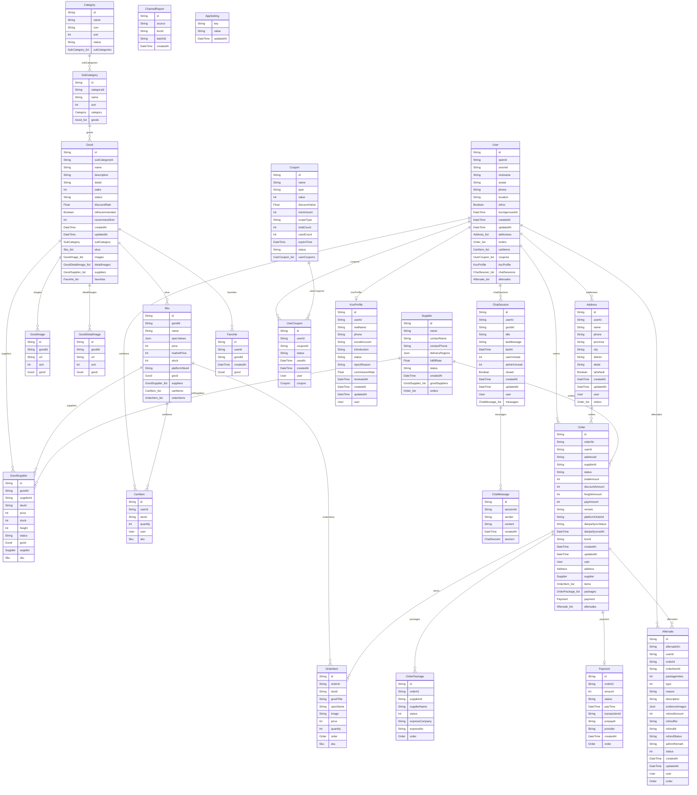

# 数据库 ER 图

> 自动生成于 2026/7/8 19:38:13，源文件：`vshop-server/prisma/schema.prisma`

```mermaid
erDiagram
    User {
        String id
        String openid
        String unionId
        String nickname
        String avatar
        String phone
        String location
        Boolean isKoc
        DateTime kocApprovedAt
        DateTime createdAt
        DateTime updatedAt
        Address_list addresses
        Order_list orders
        CartItem_list cartItems
        UserCoupon_list coupons
        KocProfile kocProfile
        ChatSession_list chatSessions
        Aftersale_list aftersales
    }
    Address {
        String id
        String userId
        String name
        String phone
        String province
        String city
        String district
        String detail
        Boolean isDefault
        DateTime createdAt
        DateTime updatedAt
        User user
        Order_list orders
    }
    Category {
        String id
        String name
        String icon
        Int sort
        String status
        SubCategory_list subCategories
    }
    SubCategory {
        String id
        String categoryId
        String name
        Int sort
        Category category
        Good_list goods
    }
    Good {
        String id
        String subCategoryId
        String name
        String description
        String detail
        Int sales
        String status
        Float discountRate
        Boolean isRecommended
        Int recommendSort
        DateTime createdAt
        DateTime updatedAt
        SubCategory subCategory
        Sku_list skus
        GoodImage_list images
        GoodDetailImage_list detailImages
        GoodSupplier_list suppliers
        Favorite_list favorites
    }
    GoodImage {
        String id
        String goodId
        String url
        Int sort
        Good good
    }
    GoodDetailImage {
        String id
        String goodId
        String url
        Int sort
        Good good
    }
    Sku {
        String id
        String goodId
        String name
        Json specValues
        Int price
        Int marketPrice
        Int stock
        String platformSkuId
        Good good
        GoodSupplier_list suppliers
        CartItem_list cartItems
        OrderItem_list orderItems
    }
    Supplier {
        String id
        String name
        String contactName
        String contactPhone
        Json deliveryRegions
        Float fulfillRate
        String status
        DateTime createdAt
        GoodSupplier_list goodSuppliers
        Order_list orders
    }
    GoodSupplier {
        String id
        String goodId
        String supplierId
        String skuId
        Int price
        Int stock
        Int freight
        String status
        Good good
        Supplier supplier
        Sku sku
    }
    CartItem {
        String id
        String userId
        String skuId
        Int quantity
        User user
        Sku sku
    }
    Order {
        String id
        String orderSn
        String userId
        String addressId
        String supplierId
        String status
        Int totalAmount
        Int discountAmount
        Int freightAmount
        Int payAmount
        String remark
        String platformOrderId
        String dianjiaSyncStatus
        DateTime dianjiaSyncedAt
        String kocId
        DateTime createdAt
        DateTime updatedAt
        User user
        Address address
        Supplier supplier
        OrderItem_list items
        OrderPackage_list packages
        Payment payment
        Aftersale_list aftersales
    }
    OrderItem {
        String id
        String orderId
        String skuId
        String goodTitle
        String specName
        String image
        Int price
        Int quantity
        Order order
        Sku sku
    }
    OrderPackage {
        String id
        String orderId
        String supplierId
        String supplierName
        Int status
        String expressCompany
        String expressNo
        Order order
    }
    Payment {
        String id
        String orderId
        Int amount
        String status
        DateTime payTime
        String transactionId
        String prepayId
        String provider
        DateTime createdAt
        Order order
    }
    Favorite {
        String id
        String userId
        String goodId
        DateTime createdAt
        Good good
    }
    Coupon {
        String id
        String name
        String type
        Int value
        Float discountValue
        Int minAmount
        String scopeType
        Int totalCount
        Int usedCount
        DateTime expireTime
        String status
        UserCoupon_list userCoupons
    }
    UserCoupon {
        String id
        String userId
        String couponId
        String status
        DateTime usedAt
        DateTime createdAt
        User user
        Coupon coupon
    }
    ChannelReport {
        String id
        String source
        String kocId
        String batchId
        DateTime createdAt
    }
    KocProfile {
        String id
        String userId
        String realName
        String phone
        String socialAccount
        String introduction
        String status
        String rejectReason
        Float commissionRate
        DateTime reviewedAt
        DateTime createdAt
        DateTime updatedAt
        User user
    }
    ChatSession {
        String id
        String userId
        String goodId
        String title
        String lastMessage
        DateTime lastAt
        Int userUnread
        Int adminUnread
        Boolean closed
        DateTime createdAt
        DateTime updatedAt
        User user
        ChatMessage_list messages
    }
    ChatMessage {
        String id
        String sessionId
        String sender
        String content
        DateTime createdAt
        ChatSession session
    }
    Aftersale {
        String id
        String aftersaleSn
        String userId
        String orderId
        String orderItemId
        Int packageIndex
        Int type
        String reason
        String description
        Json evidenceImages
        Int refundAmount
        String refundNo
        String refundId
        String refundStatus
        String adminRemark
        Int status
        DateTime createdAt
        DateTime updatedAt
        User user
        Order order
    }
    AppSetting {
        String key
        String value
        DateTime updatedAt
    }

    User ||--o{ Address : "addresses"
    User ||--o{ Order : "orders"
    User ||--o{ CartItem : "cartItems"
    User ||--o{ UserCoupon : "coupons"
    User ||--o| KocProfile : "kocProfile"
    User ||--o{ ChatSession : "chatSessions"
    User ||--o{ Aftersale : "aftersales"
    Address ||--o{ Order : "orders"
    Category ||--o{ SubCategory : "subCategories"
    SubCategory ||--o{ Good : "goods"
    Good ||--o{ Sku : "skus"
    Good ||--o{ GoodImage : "images"
    Good ||--o{ GoodDetailImage : "detailImages"
    Good ||--o{ GoodSupplier : "suppliers"
    Good ||--o{ Favorite : "favorites"
    Sku ||--o{ GoodSupplier : "suppliers"
    Sku ||--o{ CartItem : "cartItems"
    Sku ||--o{ OrderItem : "orderItems"
    Supplier ||--o{ GoodSupplier : "goodSuppliers"
    Supplier ||--o{ Order : "orders"
    Order ||--o{ OrderItem : "items"
    Order ||--o{ OrderPackage : "packages"
    Order ||--o| Payment : "payment"
    Order ||--o{ Aftersale : "aftersales"
    Coupon ||--o{ UserCoupon : "userCoupons"
    ChatSession ||--o{ ChatMessage : "messages"
```
